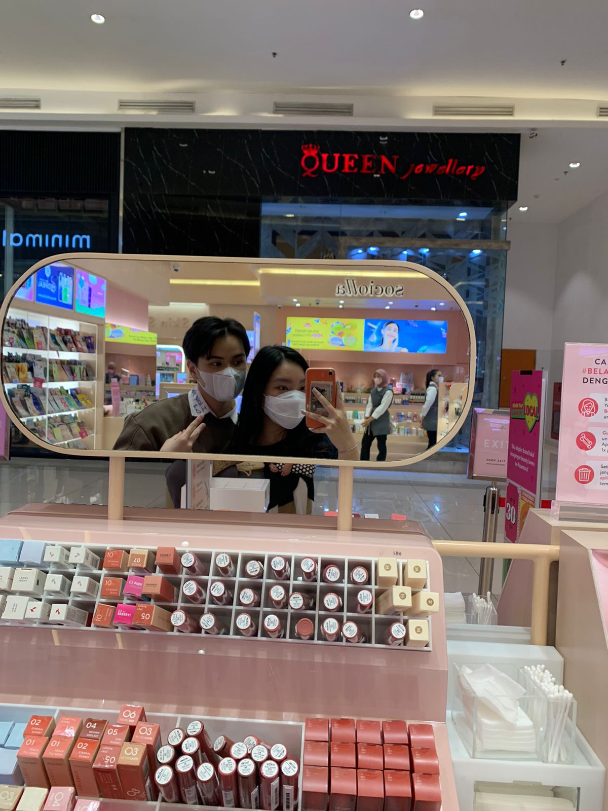
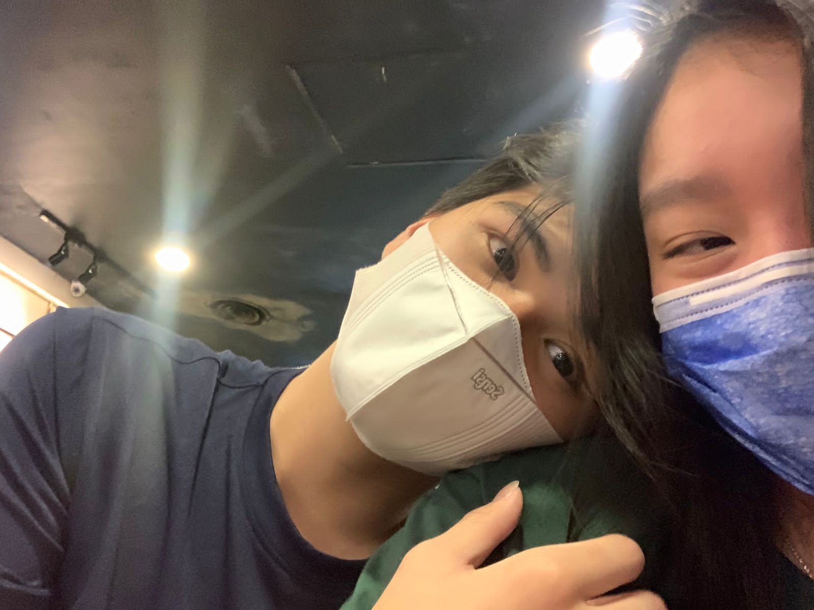
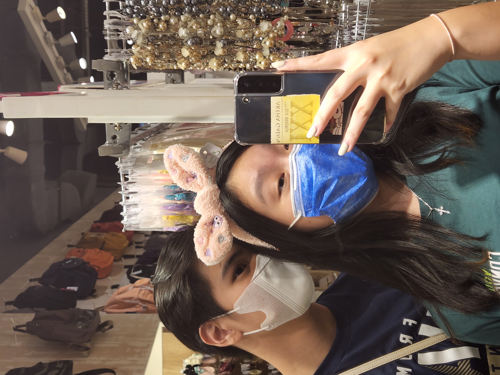

# SCROLL KEBAWAH DEHHHHH
 

<a href="https://www.google.com">
            <button onclick="doSomething()" style="background-color:#333333;color:#00FF00;border-radius:5px">click me!</button>
        </a>
<a href="https://www.google.com">
            <button onclick="doSomething()" style="background-color:#333333;color:#00FF00;border-radius:5px">click me!</button>
        </a>
<a href="https://www.google.com">
            <button onclick="doSomething()" style="background-color:#333333;color:#00FF00;border-radius:5px">click me!</button>
        </a>
<a href="https://www.google.com">
            <button onclick="doSomething()" style="background-color:#333333;color:#00FF00;border-radius:5px">click me!</button>
        </a>
<a href="https://www.google.com">
            <button onclick="doSomething()" style="background-color:#333333;color:#00FF00;border-radius:5px">click me!</button>
        </a>
        

